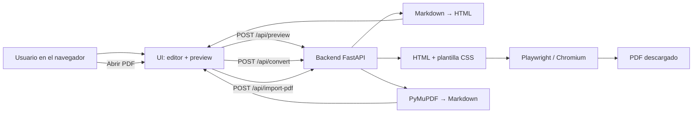

# MD-PDF

Aplicación **local** para convertir **Markdown ↔ PDF** con vista previa en el navegador.

Pensada para uso personal o en un equipo pequeño: corrés un servidor en tu máquina, pegás o subís un `.md` (o importás un PDF con texto), revisás cómo queda y descargás el PDF. No hace falta cuenta ni servicio en la nube: MD→PDF usa **Python + FastAPI + Playwright (Chromium)**; PDF→Markdown usa **PyMuPDF** en tu PC. Las dependencias viven en un **`.venv`**.

---

## Cómo funciona (flujo)



### Paso a paso

1. **Entrada** — **Abrir Markdown**, pegás texto, o **Abrir PDF** (PDF con texto seleccionable).
2. **Preview** — Con debounce, `POST /api/preview` muestra la hoja HTML con la plantilla (Informe / Notas / Técnico).
3. **Acciones según origen** — Tras **Abrir Markdown**: solo **Generar PDF**. Tras **Abrir PDF**: solo **Generar Markdown**.
4. **Generar PDF** — `POST /api/convert` → Playwright → descarga `.pdf` (copia en `output/` solo con `SAVE_TO_OUTPUT=1`).

**Abrir PDF:** la extracción es local y **con pérdida**. PDFs escaneados no están soportados (sin OCR). Detalle: [`docs/12-PDF-TO-MD.md`](./docs/12-PDF-TO-MD.md).

Todo el tráfico de la app es `localhost` (`127.0.0.1`). El contenido del documento no se envía a un API cloud de MD-PDF.

---

## Requisitos

- **Python 3.12+**
- Espacio en disco (~300 MB la primera vez) para Chromium de Playwright
- Red solo para instalar dependencias (`pip` / `playwright install`)

---

## Instalación

```powershell
git clone <url-del-repo>
cd MD-PDF
python -m venv .venv
.\.venv\Scripts\Activate.ps1
pip install -r requirements.txt
playwright install chromium
```

macOS / Linux:

```bash
git clone <url-del-repo>
cd MD-PDF
python -m venv .venv
source .venv/bin/activate
pip install -r requirements.txt
playwright install chromium
```

`playwright install chromium` descarga el navegador que usa el backend para “imprimir” HTML a PDF. Hace falta una vez por máquina (o tras actualizar Playwright).

---

## Arranque

Con el `.venv` activo:

```powershell
python run.py
```

Equivalente: `.\scripts\dev.ps1` (Windows) o `./scripts/dev.sh` (Unix).

| Recurso | URL |
|---------|-----|
| Aplicación | http://127.0.0.1:8765 |
| Documentación interactiva de la API | http://127.0.0.1:8765/docs |
| Salud del servicio | http://127.0.0.1:8765/api/health |

Deberías ver algo como `"playwright": "ready"`.

Opciones útiles:

```powershell
python run.py --port 9000      # otro puerto
python run.py --reload         # recarga código (en Windows puede ser menos estable)
```

Puerto por defecto: **8765** (en algunos Windows el 8000 está bloqueado o reservado).

---

## Uso en la interfaz

1. Abrí http://127.0.0.1:8765
2. **Abrir Markdown** o **Abrir PDF** (o arrastrá un archivo)
3. Elegí plantilla: **Informe**, **Notas** o **Técnico**
4. Usá **Editar / Ver** en el panel Markdown
5. **Abrir Markdown** → solo **Generar PDF** · **Abrir PDF** → solo **Generar Markdown**

### Atajos

| Atajo | Acción |
|-------|--------|
| `Ctrl+Enter` / `Cmd+Enter` | Generar PDF (modo Markdown) |
| `Ctrl+O` / `Cmd+O` | Abrir Markdown |

### Frontmatter (opcional)

Al inicio del archivo:

```markdown
---
title: Informe mensual
author: Nombre
date: 2026-07-24
---

Contenido del documento…
```

Eso genera una cabecera en el documento (título / autor / fecha) además del cuerpo Markdown.

### Privacidad al usar

- Look de producto web, pero **todo corre en local** (`127.0.0.1`): sin cuentas ni cloud.
- La UI **no carga tipografías ni scripts desde CDN** (fuentes del sistema).
- Si el Markdown tiene URLs `http://` o `https://` (por ejemplo imágenes remotas), la UI muestra un **aviso**: al generar el PDF, Chromium puede **descargar esos recursos** desde internet.
- Para máxima privacidad offline: evitá recursos remotos; usá data URI o texto local.
- Detalle: [`docs/11-PRIVACIDAD.md`](./docs/11-PRIVACIDAD.md)

---

## Qué incluye

- **Abrir Markdown** → preview HTML → **Generar PDF** (A4)
- **Abrir PDF** → Markdown editable (local, con pérdida) → **Generar Markdown**
- CTAs excluyentes: no se muestra Generar Markdown al abrir un `.md`, ni Generar PDF tras importar un PDF
- Toggle **Editar / Ver**; paneles compactos con scroll propio
- UI tipo SaaS (paneles, contador, estado en footer) 100% local
- Highlight de código, tablas, listas, blockquotes
- Frontmatter YAML
- Tres plantillas CSS de documento
- API REST local (`/api/preview`, `/api/convert`, `/api/import-pdf`, etc.)
- Documentación técnica en [`docs/`](./docs/)

---

## Estructura del proyecto

```
MD-PDF/
  client/          # UI (HTML, CSS, JS)
  server/          # FastAPI, servicios Markdown y PDF
  shared/themes/   # CSS de plantillas del documento
  fixtures/        # .md de ejemplo para pruebas
  output/          # Carpeta reservada (ver abajo); vacía en el repo
  scripts/         # Arranque y utilidades
  docs/            # Documentación detallada
  run.py           # Launcher recomendado
  requirements.txt
```

### Carpeta `output/`

Es un directorio **opcional** para guardar copias locales de PDF si activás esa función.

- En el repositorio solo debe existir vacía (`.gitkeep`). Los `*.pdf` están en `.gitignore`.
- **Por defecto la app no escribe ahí**: solo descarga el PDF en el navegador.
- Si querés copias en disco: `SAVE_TO_OUTPUT=1` al arrancar (por ejemplo en PowerShell `$env:SAVE_TO_OUTPUT=1; python run.py`).

No subas PDF con datos personales al remoto.

---

## API (resumen)

Base: `http://127.0.0.1:8765`

| Método | Ruta | Descripción |
|--------|------|-------------|
| `GET` | `/api/health` | Estado del servicio y de Playwright |
| `GET` | `/api/themes` | Plantillas disponibles |
| `POST` | `/api/preview` | Body `{ "markdown", "theme?" }` → `{ "html", "meta", "theme" }` |
| `POST` | `/api/convert` | Body `{ "markdown", "filename?", "theme?" }` → archivo PDF |
| `POST` | `/api/convert-file` | `multipart` con archivo `.md` → PDF |
| `POST` | `/api/import-pdf` | `multipart` con archivo `.pdf` → `{ "markdown", … }` |

Documentación completa: [`docs/04-API.md`](./docs/04-API.md) o `/docs` con el servidor en marcha.

---

## Pruebas locales (opcional)

Con el servidor levantado:

```powershell
.\.venv\Scripts\python.exe scripts\smoke_test.py
.\scripts\render_fixtures.ps1
```

Los fixtures están en `fixtures/` (ejemplos genéricos, sin datos personales).

---

## Documentación adicional

| Documento | Tema |
|-----------|------|
| [docs/00-VISION.md](./docs/00-VISION.md) | Visión y alcance |
| [docs/01-STACK.md](./docs/01-STACK.md) | Stack y dependencias |
| [docs/02-ARQUITECTURA.md](./docs/02-ARQUITECTURA.md) | Arquitectura |
| [docs/03-SETUP.md](./docs/03-SETUP.md) | Setup y troubleshooting |
| [docs/05-FRONTEND.md](./docs/05-FRONTEND.md) | UI |
| [docs/06-MARKDOWN.md](./docs/06-MARKDOWN.md) | Sintaxis soportada |
| [docs/07-PDF.md](./docs/07-PDF.md) | Generación PDF |
| [docs/11-PRIVACIDAD.md](./docs/11-PRIVACIDAD.md) | Privacidad / offline |
| [docs/12-PDF-TO-MD.md](./docs/12-PDF-TO-MD.md) | Importar PDF → Markdown |

---

## Limitaciones (a propósito)

- Uso **local** (no pensado como SaaS público)
- Sin autenticación ni multiusuario
- Sin editor WYSIWYG
- Imágenes por ruta relativa del disco aún no están soportadas (preferí data URI)
- PDF → Markdown **no es idéntico** al original; sin OCR para escaneados

---

## Licencia

Usá y adaptá el proyecto según tus necesidades. Si lo publicás o forkeás, evitá incluir PDF o Markdown con datos personales en el historial de Git.
