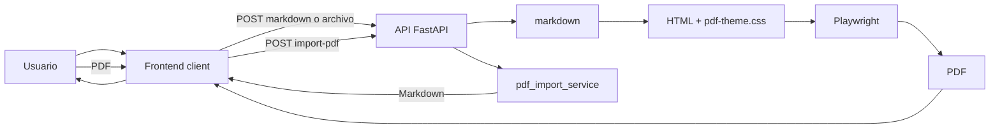

# 02 — Arquitectura

## Estructura de carpetas (objetivo)

```
MD-PDF/
  README.md
  docs/                 # Documentación (fuente de verdad)
  requirements.txt      # Deps Python (instalar en .venv)
  .venv/                # Entorno virtual (gitignored)
  .gitignore
  server/               # Backend FastAPI
    __init__.py
    main.py             # Entry: app, montaje static, rutas
    routes/             # health, preview, convert, import-pdf
    services/
      markdown_service.py
      pdf_service.py
      pdf_import_service.py  # PDF → Markdown
    templates/          # Envoltorio HTML del documento PDF
  client/               # Frontend estático (servido por FastAPI)
    index.html
    styles.css
    app.js
  shared/
    pdf-theme.css       # Estilos del PDF (y preview)
  fixtures/             # .md de prueba (Fase 4)
  output/               # Vacía en repo; copias locales solo si SAVE_TO_OUTPUT=1
```

## Flujo de datos



### Preview

1. Usuario sube `.md` o escribe en el textarea
2. Frontend envía Markdown a `POST /api/preview` (con debounce)
3. Backend: Markdown → HTML
4. Frontend muestra el HTML en el panel preview

### Convertir a PDF

1. Usuario pulsa “Generar PDF”
2. Frontend envía Markdown (+ nombre opcional) a `POST /api/convert`
3. Backend: Markdown → HTML → plantilla → Playwright → bytes PDF
4. Frontend descarga el blob como `.pdf`

### Importar PDF → Markdown

1. Usuario elige **Abrir PDF** o suelta un `.pdf`
2. UI pasa a **modo PDF**: izquierda = PDF original (blob local), derecha = Markdown
3. Frontend: `POST /api/import-pdf`
4. Backend: bytes PDF → Markdown (PyMuPDF / pymupdf4llm)
5. Editor a la derecha; aviso de conversión con pérdida; toggle Editar/Ver

Con **Abrir .md**, la UI usa **modo Markdown**: izquierda = Markdown (Editar/Ver), derecha = “Vista PDF” (hoja HTML con plantilla). El PDF binario de descarga sigue saliendo de Playwright al pulsar Generar PDF.

El **preview puede ser rápido**; la **fuente de verdad del PDF descargado es el backend**. Detalle del import: [12-PDF-TO-MD](./12-PDF-TO-MD.md). UI: [05-FRONTEND](./05-FRONTEND.md).

## Responsabilidades

| Parte | Hace | No hace |
|-------|------|---------|
| Frontend (`client/`) | UI, estado, debounce, descarga, import PDF | Generar PDF de producción |
| `markdown_service.py` | Parsear MD a HTML | Layout de impresión |
| `pdf_service.py` | Playwright + opciones A4 | Parsear Markdown ni importar PDF |
| `pdf_import_service.py` | PDF → Markdown local | Generar PDF |
| `shared/pdf-theme.css` | Estilo del documento | Lógica de app |
| `output/` | Copias locales opt-in (`SAVE_TO_OUTPUT`) | No se versiona contenido |

## Puertos

| Servicio | Puerto | URL |
|----------|--------|-----|
| FastAPI (API + UI estática) | 8765 (default vía `run.py`) | `http://127.0.0.1:8765` |

Un solo proceso: Uvicorn sirve `/api/*` y los estáticos de `client/` en `/`. Arranque recomendado: `python run.py`.

## Seguridad (contexto local)

- App pensada solo para localhost
- Validar extensión/tipo `.md` / `text/markdown` / `text/plain` / `.pdf` (import)
- Limitar tamaño: 2 MB Markdown; 15 MB PDF import
- No ejecutar Markdown como código; HTML generado sin HTML crudo del usuario (`safe_mode` / sin `html` raw)
- PDFs se parsean en proceso local; no se envían a terceros
- Bind a `127.0.0.1` en v1

## Relación con otros docs

- Endpoints: [04-API](./04-API.md)
- UI: [05-FRONTEND](./05-FRONTEND.md)
- Pipeline PDF (salida): [07-PDF](./07-PDF.md)
- Import PDF: [12-PDF-TO-MD](./12-PDF-TO-MD.md)
