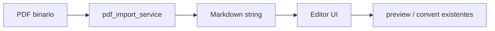

# 12 — PDF → Markdown

## Objetivo

Importar un PDF **con texto seleccionable** y obtener Markdown editable en el editor, para revisar, corregir y (opcionalmente) volver a exportar a PDF con el flujo existente.

La conversión es **local** (sin APIs cloud) y **con pérdida**: no recupera el `.md` original ni el layout tipográfico exacto.

## Flujo

1. Usuario elige **Abrir PDF** (o suelta un `.pdf`)
2. UI en **modo PDF**: izquierda = PDF original (blob), derecha = Markdown (Editar/Ver)
3. Frontend: `POST /api/import-pdf` (multipart)
4. Backend: PyMuPDF + pymupdf4llm → Markdown
5. Texto en el editor; aviso de pérdida
6. “Vista PDF” HTML del modo Markdown no se muestra en este layout (solo PDF | MD)

## Dependencias (`.venv`)

| Paquete | Uso |
|---------|-----|
| `pymupdf` | Abrir PDF en memoria |
| `pymupdf4llm` | Extracción orientada a Markdown |

No usa Playwright (Playwright sigue solo para MD → PDF).

## Calidad esperada (v1)

| Incluye | No incluye |
|---------|------------|
| PDF digital con texto | OCR / PDFs escaneados |
| Párrafos, headings aproximados | Layout multi-columna perfecto |
| Listas y tablas simples | Math / Mermaid |
| Texto de código si viene como texto | Imágenes como assets locales |
| Avisos de pérdida en API/UI | Round-trip MD→PDF→MD idéntico |

## Límites

| Límite | Valor |
|--------|-------|
| Tamaño máximo PDF | 15 MB |
| Extensión | `.pdf` |
| Timeout | razonablemente acotado por el proceso local |

El límite de **2 MB** del Markdown (`MAX_UPLOAD_BYTES`) **no** se aplica al upload del PDF; el Markdown resultante sí puede validarse después si se reenvía a preview/convert.

## API

Ver [04-API](./04-API.md) — `POST /api/import-pdf`.

## Errores típicos

| Situación | Código | Mensaje (idea) |
|-----------|--------|----------------|
| No es PDF / vacío | 400 | Archivo inválido |
| Demasiado grande | 413 | Supera 15 MB |
| Sin texto (posible escaneado) | 422 | PDF sin texto extraíble; OCR no soportado |
| Fallo del extractor | 500 | Error al importar |

## Criterio de hecho

- [x] Endpoint import-pdf responde Markdown no vacío para un PDF de texto
- [x] UI: Abrir PDF carga el editor y el preview
- [x] Aviso de conversión con pérdida visible
- [x] PDF escaneado / sin texto → error claro (`422`)
- [x] Flujo MD → PDF original intacto (smoke)
- [x] Docs y checklist actualizados

## Descarga del Markdown

Tras importar, el texto queda en el editor. Con **Descargar .md** se guarda un archivo local (mismo nombre base que el PDF o el `.md` sugerido por la API). No requiere un endpoint nuevo: es descarga en el navegador.

## Fuera de alcance (esta entrega)

- OCR (Tesseract u otros)
- APIs cloud de documentos
- CLI dedicado `pdf → md` (ver backlog P3)

## Relación

- Stack: [01-STACK](./01-STACK.md)
- Arquitectura: [02-ARQUITECTURA](./02-ARQUITECTURA.md)
- PDF de salida: [07-PDF](./07-PDF.md)
- Privacidad: [11-PRIVACIDAD](./11-PRIVACIDAD.md)
